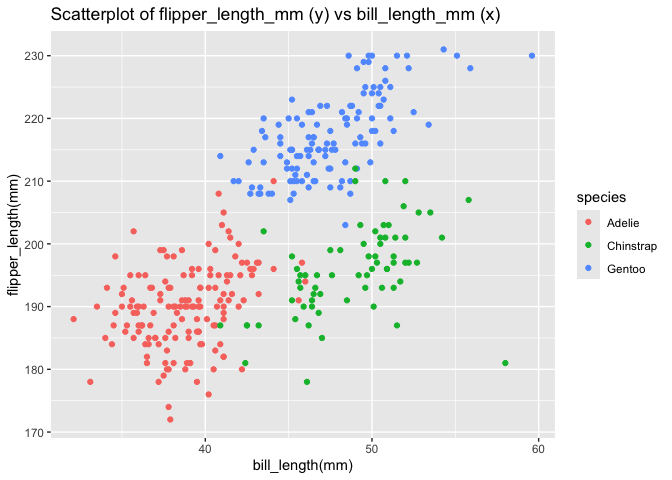

p8105_hw1_cr3442
================
Cheng Rao
2024-09-21

The purpose of this file is to finish p8105 homework 1 and test if I can
submit the .Rmd successfully to the Github as I am just a beginner in R.
This assignment will try to be consistent in format with a solution in
Lecture ‘Writing with data’. Now let me first deal with Problem 1.

# Problem 1

First we download a package containing the penguins dataset.

``` r
install.packages("palmerpenguins")
```

then we load the penguins dataset.

``` r
data("penguins", package = "palmerpenguins")
```

Next we use inline R code to describe the data in this dataset, by using
summary() and str(). At first summary().

``` r
penguins_summary <- summary(penguins)
```

Next str().

``` r
structure_penguins <- str(penguins)
```

    ## tibble [344 × 8] (S3: tbl_df/tbl/data.frame)
    ##  $ species          : Factor w/ 3 levels "Adelie","Chinstrap",..: 1 1 1 1 1 1 1 1 1 1 ...
    ##  $ island           : Factor w/ 3 levels "Biscoe","Dream",..: 3 3 3 3 3 3 3 3 3 3 ...
    ##  $ bill_length_mm   : num [1:344] 39.1 39.5 40.3 NA 36.7 39.3 38.9 39.2 34.1 42 ...
    ##  $ bill_depth_mm    : num [1:344] 18.7 17.4 18 NA 19.3 20.6 17.8 19.6 18.1 20.2 ...
    ##  $ flipper_length_mm: int [1:344] 181 186 195 NA 193 190 181 195 193 190 ...
    ##  $ body_mass_g      : int [1:344] 3750 3800 3250 NA 3450 3650 3625 4675 3475 4250 ...
    ##  $ sex              : Factor w/ 2 levels "female","male": 2 1 1 NA 1 2 1 2 NA NA ...
    ##  $ year             : int [1:344] 2007 2007 2007 2007 2007 2007 2007 2007 2007 2007 ...

The we describe the size of the dataset (using nrow and ncol).

``` r
# The size of the dataset (using nrow and ncol)
number_rows <- nrow(penguins)
number_cols <- ncol(penguins)
```

Then we calculate the mean of flipper length.

``` r
# The mean flipper length, ignoring missing value and calculate the mean
mean_flipper_length <- mean(penguins$flipper_length_mm, na.rm = TRUE)
```

Next we make a scatterplot of flipper_length_mm (y) vs bill_length_mm
(x).

``` r
library(ggplot2)

# Make a scatterplot and the color points is using the species variable inside of aes, Use na.rm = TRUE to ignore missing values
ggplot(data = penguins, aes(x = bill_length_mm, y = flipper_length_mm, color = species)) +
 
   geom_point(na.rm = TRUE) +
  
  labs(title = "Scatterplot of flipper_length_mm (y) vs bill_length_mm (x)", x = "bill_length(mm)", y = "flipper_length(mm)") 
```

<!-- -->

Now Problem 1 is finshed already and I want to summit it to the Github.

# Problem 2

I to need create a data frame containing four different types of
variables and find the means of these variables. Finally, I need to try
to use as.numeric to force conversion of three of the variables.

First let’s create the data frame.

``` r
# Use knitr package for better table formatting
library(knitr)

# Create a data frame containing four different types of variables
df <- data.frame(
  
  numeric_sample = rnorm(10),  # A random sample of size 10 from a standard Normal distribution
 
  logical_vector = rnorm(10) > 0,  # A logical vector indicating whether elements of the sample are greater than 0
  
  character_vector = letters[1:10],  # A character vector of length 10
  
  factor_vector = factor(rep(c("Level 1", "Level 2", "Level 3"), length.out = 10))  # A factor vector of length 10, with 3 different factor “levels”

  )

# Show the data frame using kable
kable(df)
```

| numeric_sample | logical_vector | character_vector | factor_vector |
|---------------:|:---------------|:-----------------|:--------------|
|      0.3387362 | TRUE           | a                | Level 1       |
|     -0.0271188 | FALSE          | b                | Level 2       |
|     -0.7016645 | TRUE           | c                | Level 3       |
|      1.5130668 | TRUE           | d                | Level 1       |
|      1.1414713 | TRUE           | e                | Level 2       |
|     -0.6746972 | TRUE           | f                | Level 3       |
|     -1.2569678 | FALSE          | g                | Level 1       |
|      0.1190213 | TRUE           | h                | Level 2       |
|     -0.9368782 | FALSE          | i                | Level 3       |
|     -0.1288214 | TRUE           | j                | Level 1       |

Next I am going to calculate the means of these variables, the tidyverse
is already loading and I will use the pull function.

``` r
# Calculate the means of these variables,using mean(df)
mean_numeric <- mean(pull(df, numeric_sample))
mean_logical <- mean(pull(df, logical_vector))

# The two variables cannot be directly averaged, so try() is used, and silent = TRUE is used to suppress the printing of error messages
mean_character <- try(mean(pull(df, character_vector)), silent = TRUE)
```

    ## Warning in mean.default(pull(df, character_vector)): argument is not numeric or
    ## logical: returning NA

``` r
mean_factor <- try(mean(pull(df, factor_vector)), silent = TRUE)
```

    ## Warning in mean.default(pull(df, factor_vector)): argument is not numeric or
    ## logical: returning NA

``` r
# Print the results
mean_numeric
```

    ## [1] -0.06138523

``` r
mean_logical
```

    ## [1] 0.7

``` r
mean_character
```

    ## [1] NA

``` r
mean_factor
```

    ## [1] NA

The results show that the meaning of numeric and logical works and the
meaning of character and factor doesn’t work.

Then I write a code chunk that applies the as.numeric function to the
logical, character, and factor variables and try to coerce them to
numeric, so I use numeric_xxx to represent these variables.

``` r
# coerce variables to numeric
numeric_logical <- as.numeric(df$logical_vector)
numeric_character <- as.numeric(df$character_vector)
```

    ## Warning: NAs introduced by coercion

``` r
numeric_factor <- as.numeric(df$factor_vector)
```

At last the problem 2 is done and hence the homework 1 is finished. I
hope I make fewer mistakes.
